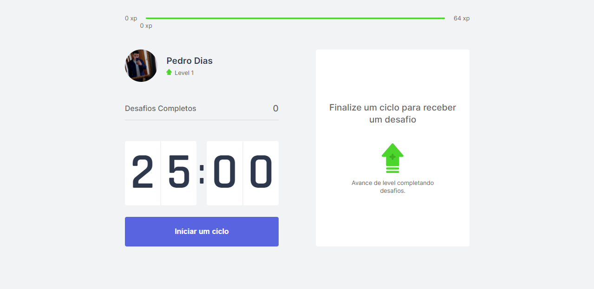

<h1 align="center">
  MoveIt
</h1>

<h1 align="center">
  https://moveit-h9tlq1493-diaspd.vercel.app/
</h1>

<br></br>

<p align="center">
  <a href="#-Technologies">Technologies</a>&nbsp;&nbsp;&nbsp;|&nbsp;&nbsp;&nbsp;
  <a href="#-Project">Project</a>&nbsp;&nbsp;&nbsp;|&nbsp;&nbsp;&nbsp;
  <a href="#-Layout">Layout</a>&nbsp;&nbsp;&nbsp;
</p>

<br>

<h1 align="center">
  
</h1>


## 🚀 Getting started

Clone the project and access the folder.

```bash
$ git@github.com:diaspd/Move.it.git
$ cd 
```

Follow the steps below:
```bash
# Install the dependencies
$ npm i

# Start the project
$ npm start
```
The app will be available for access on your browser at http://localhost:3000

<br></br>

## 💻 Technologies

This project was developed with the following technologies:

- TypeScript
- React
- NextJs


## 📄 Project
💰A project made like a "Pomodoro Timer", for people who spend a lot of time in front of the computer and need to rest their eyes and body.

<br></br>

Feito com ♥ by Pedro Dias (😎)<br></br>
https://www.instagram.com/dias_pdr/ <br></br>
https://www.facebook.com/PedroDias24/<br></br>
https://twitter.com/diaspdr_1<br></br>
https://www.twitch.tv/diasgm_pdr<br></br>

Se puder dar uma estrelinha, eu agradeço 🤩
<br></br>
If you can give a little star, I appreciate it 🤩
